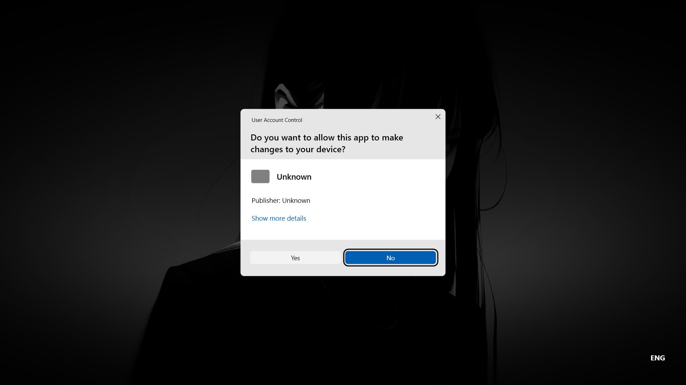
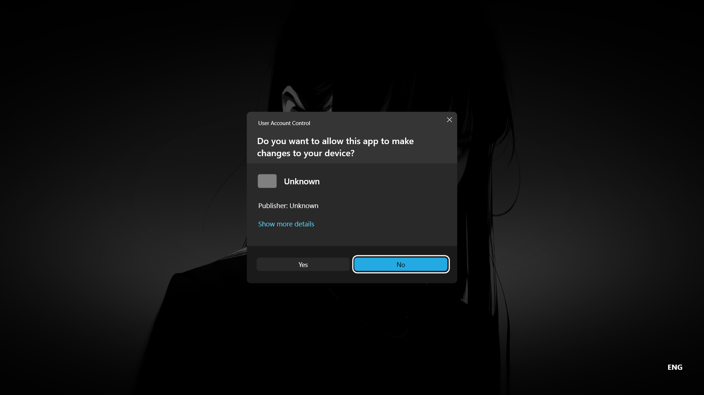

## Preview

### DEMO video

**Warning:**
This demo contains a sudden video playback and a forced volume increase.
[Demo video](https://6Asahi9.github.io/FakeUACWPF/media/Demo.mp4)

### Light mode

### Dark mode

## About

FakeUAC is a **pixel-perfect (1:1) visual replica of the Windows 11 Home UAC dialog**, built in WPF for **educational and UI-learning purposes**.

This project focuses on:

- WPF layout accuracy
- Styling and theming (Light / Dark)
- Resource management

## Customization

If you want to change the **Publisher name** or app-related text:

- Open `MainWindow.xaml`
- Look for the section marked:
  `<!-- App info -->`
- Modify the values there

## Intentional Limitations

The following elements are **intentionally non-functional**:

- "ENG"
- "Show more details"

This is done **on purpose** to prevent misuse or deceptive real-world usage.

## Behavior on "Yes"

When the **Yes** button is clicked:

- Themes automatically change according to the system's theme (Light / Dark)
- A jumpscare video from the `Resources` folder is played named "jumpscare_cut.mp4"
- System volume is forcefully increased during jumpscare and then put the volume back to where it was before

This behavior is intentional and part of the project’s demonstration.

## Disclaimer

This project is for **learning, demonstration, and UI experimentation only**.  
Do not use this software to deceive, impersonate, or harm others.

## Project Context

FakeUACWPF was originally designed as a supporting component for another project named
**MiyaDesktop**.

It was later separated into its own repository to keep the codebase modular and easier to
understand, while still remaining compatible with the MiyaDesktop project.

## Acknowledgements

This project was created while learning C# and WPF with the help of explanations and guidance from [ChatGPT](https://chatgpt.com/).
Assistance included understanding WPF concepts, MainWindow.xaml structure, and basic repository setup
(.gitignore and .gitattributes).
